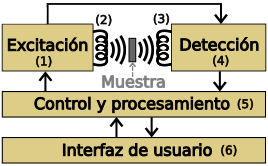
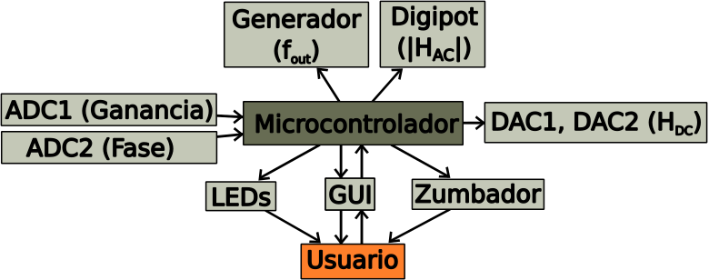
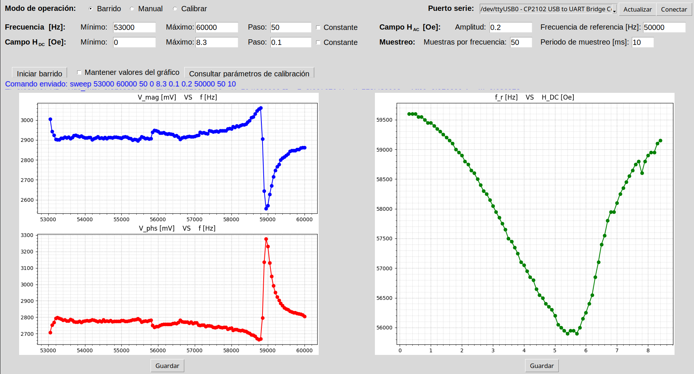
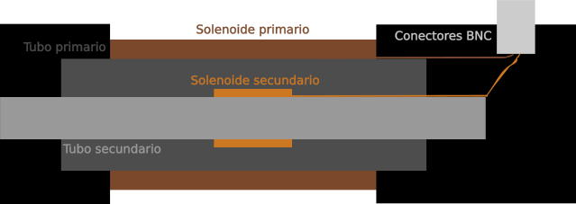
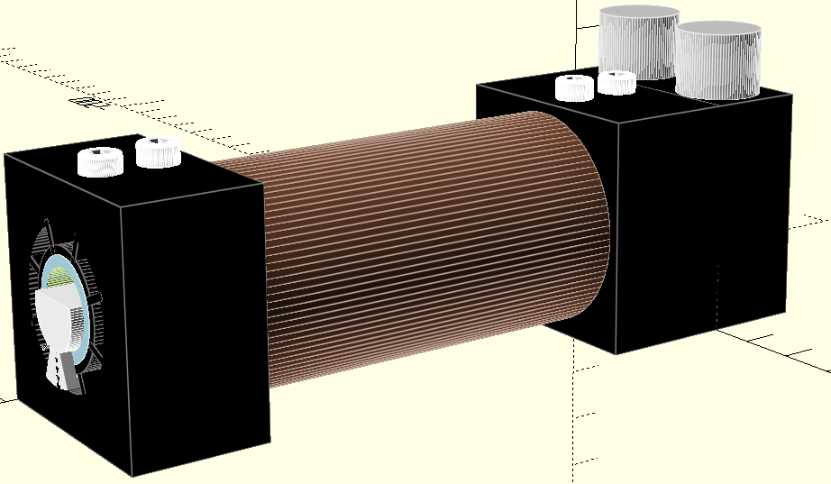
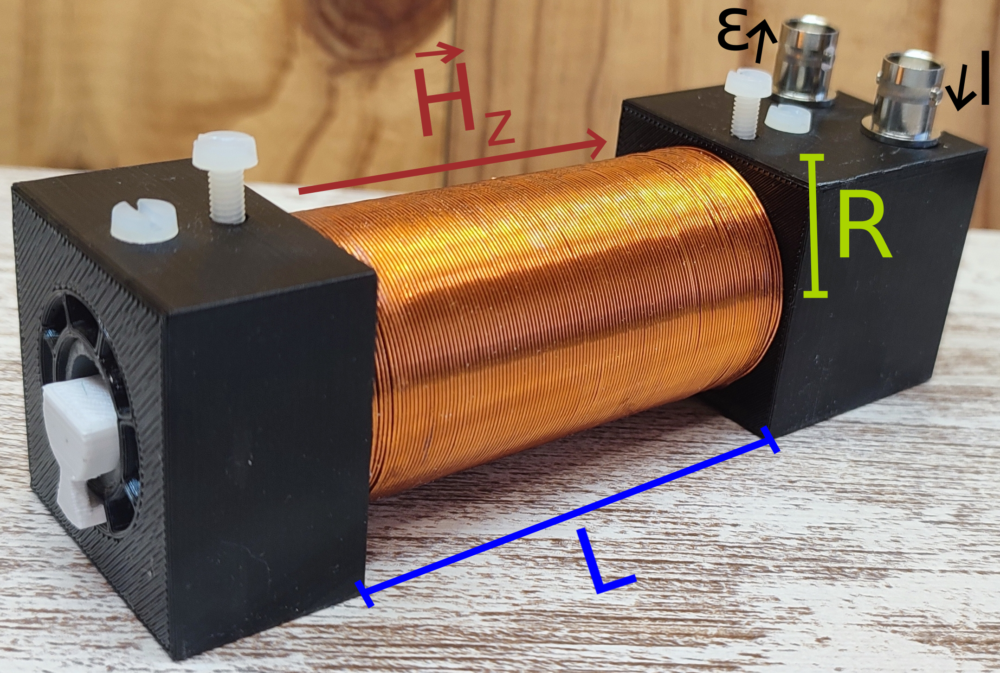
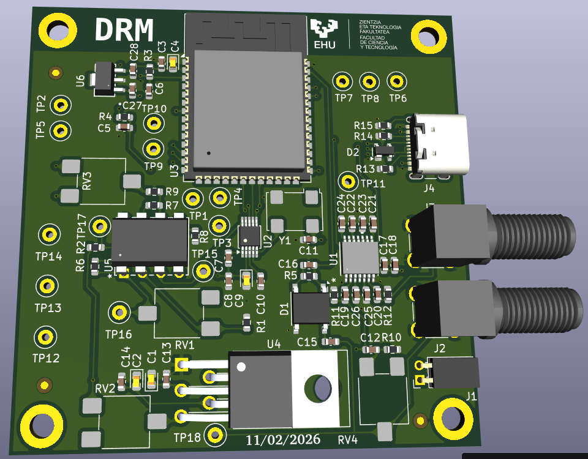

# Detector de Resonancia Magnetoelástica – Archivos del TFG

Este repositorio recopila los principales archivos desarrollados durante mi Trabajo Fin de Grado del Grado en Ingeniería Electrónica sobre el diseño y construcción de un dispositivo Detector de Resonancia Magnetoelástica.

  

El contenido se organiza en los siguientes tipos de archivos:

* **Arduino:** firmware principal del detector, desarrollado para ESP32. Se encarga del control de todos los elementos hardware del sistema, incluyendo el generador de señal, los convertidores DAC, el potenciómetro digital y la adquisición de datos mediante el ADC. Implementa distintos modos de funcionamiento (control manual, acceso a parámetros de calibración y barridos automáticos), gestionando la generación de campos magnéticos continuos y alternos, la ejecución de barridos en frecuencia y campo magnético, la adquisición de las señales de ganancia y fase, así como la comunicación con el software de control mediante el puerto serie. Además, incorpora comprobaciones de rango y resolución, junto con indicadores luminosos y acústicos para informar del estado del sistema y de posibles errores.

  

* **Python:** aplicación de escritorio desarrollada para el control del detector y la visualización de resultados. Proporciona una interfaz gráfica (GUI) desde la que es posible configurar los parámetros de medida, establecer barridos de frecuencia del campo magnético alterno y de valor del campo magnético estático, consultar los parámetros de calibración del sistema y comunicarse con el microcontrolador a través del puerto serie. Durante la adquisición de datos recibe en tiempo real las medidas de amplitud y fase, representa gráficamente su evolución, muestra la frecuencia de resonancia para cada valor de campo magnético estático y permite exportar los resultados obtenidos en formato CSV para su posterior análisis. Además, incorpora detección automática de dispositivos compatibles, gestión de errores y notificaciones del estado del sistema.

  

* **Modelos 3D:** diseños CAD de las piezas de PETG fabricadas para el sistema magnético encargado de generar y medir el campo magnético. Incluye dos soportes para fijar dos solenoides de forma coaxial. Estos soportes integran orificios para la introducción de muestras en el interior del sistema, cavidades para para el acoplamiento de conectores coaxiales y orificios roscantes que permiten fijar los solenoides mediante tornillos. Además, también incluye una tapa para cubrir la soldadura de los conectores y un portamuestras con referencias milimétricas que permiten posicionar las muestras en el interior del sistema.
  

  
  
  

  
* **KiCad:** esquema eléctrico y diseño de la placa de circuito impreso (PCB) del prototipo preindustrializado desarrollado para el proyecto. Incluye el generador de señal, circuito de adecuación y amplificación, el detector de ganancia y fase, el sistema de control y procesamiento, un conector USB tipo-C para la comunicación y conectores coaxiales para el sistema magnético.
  

  

Este repositorio tiene como objetivo facilitar la consulta, reproducción y reutilización del trabajo realizado, reuniendo en un único lugar tanto el hardware como el software desarrollados para el proyecto.
